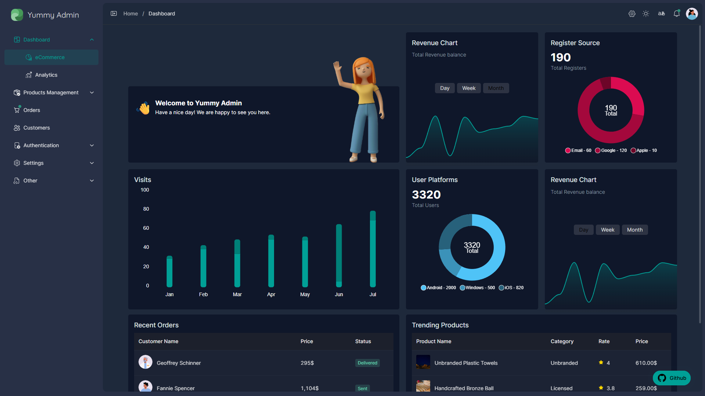
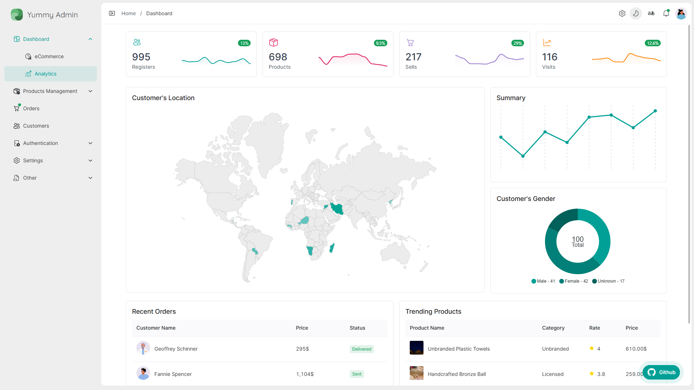

<div align="center">

# Yummy Admin — 美味管理员

**一个免费、开箱即用的 Vue 3 管理后台 —— 默认就很漂亮，原生支持 RTL，并且多语言。**

[](https://github.com/doroudi/YummyAdmin/actions/workflows/ci.yml)
[](https://app.netlify.com/sites/yummy-admin/deploys)
[](https://vuejs.org)
[](https://vite.dev)
[](https://www.naiveui.com)
[](https://echarts.apache.org)
[](./LICENSE)

[English](./README.md) · [فارسی](./README.fa-ir.md) · [简体中文](./README.zh-cn.md)

<a href="https://coff.ee/doroudi"></a>



<p>
  <a href="https://yummy-admin.netlify.app/?lang=zh"><b>🌏 在线演示</b></a> &nbsp;·&nbsp;
  <a href="https://yummy-admin.netlify.app/?lang=zh&theme=dark"><b>🌑 深色模式</b></a> &nbsp;·&nbsp;
  <a href="https://yummy-admin.netlify.app/?lang=en">英语</a> ·
  <a href="https://yummy-admin.netlify.app/?lang=fa">波斯语</a>
</p>



</div>

> **在找 Nuxt 版本？** YummyAdmin 已迁移到 Nuxt，以便使用 SSR 及其其他特性，后续开发也在那里继续。
> → **[github.com/doroudi/YummyAdmin.Nuxt](https://github.com/doroudi/YummyAdmin.Nuxt)**
>
> <a href="https://github.com/doroudi/YummyAdmin.Nuxt"></a>

## 目录

- [项目简介](#项目简介)
- [功能特性](#功能特性)
- [图表](#图表)
- [技术栈](#技术栈)
- [快速开始](#快速开始)
- [可用脚本](#可用脚本)
- [项目结构](#项目结构)
- [主题与设计令牌](#主题与设计令牌)
- [国际化](#国际化)
- [部署](#部署)
- [作为模板使用](#作为模板使用)
- [支持本项目](#支持本项目)
- [许可证](#许可证)

## 项目简介

Yummy Admin 是一个面向电商后台的管理面板：商品、分类、品牌、颜色、订单、客户、发票、评价、评论、分析与设置 —— 全部连接到可模拟的 API 层，因此无需后端即可完整浏览整个界面。

项目内置完整的 **RTL** 布局支持、**三种语言**、运行时 **主题色切换**、明暗模式，以及一个同时充当活文档的组件库页面（表单、排版、图表）。

## 功能特性

**框架与开发体验**

- ⚡️ **Vue 3.5 + Vite（rolldown）+ TypeScript** —— 开发服务器与构建都很快
- 🗂 通过 `vite-plugin-pages` 实现 **基于文件的路由**，并采用 Nuxt 风格的 **布局系统**
- 📦 组件、组合式函数、Store 与 Vue API 全部 **自动导入**
- 🧩 开箱启用的 **Vue Macros**（`defineOptions`、`defineSlots` 等）
- 🎨 **UnoCSS**，启用 attributify 模式与 Web 字体预设
- 🧹 **Biome** 负责检查与格式化，并通过 **Lefthook** 在提交时强制执行

**界面与主题**

- 🖼 **[Naive UI](https://www.naiveui.com) 2** 组件库，支持运行时主题覆盖
- 🌗 **深色 / 浅色 / 跟随系统** 三种模式
- 🎨 **运行时主题色** —— 切换主色会同时重绘 Naive UI 组件**和**所有图表
- ↔️ **完整的 RTL 支持**：镜像布局、Naive UI 的 RTL 样式包，以及跟随语言的图表图例定位（连 ECharts 画布也一并处理）

**数据与状态**

- 🍍 **Pinia** 搭配 `pinia-plugin-persistedstate` 持久化界面偏好
- 🎭 **[MSW](https://mswjs.io/) + Faker** —— 在浏览器中提供带真实延迟的仿真 REST API，无需后端
- 🔌 基于 **Axios** 的服务层（`src/common/api`），提供带类型的 `ApiService`
- 🔌 基于 **WebSocket** 的聊天应用

**电商开箱可用**

- 🛒 商品、分类、品牌、颜色、订单、客户、发票、评价与评论页面
- 📊 **电商**与**分析**两套仪表盘，含 KPI 卡片与迷你趋势图
- 🧾 支持筛选、排序、分页与批量操作的数据表格

## 图表

图表基于 **[Apache ECharts 6](https://echarts.apache.org)**，通过 **[uipkge](https://uipkge.dev/vue/charts)** 图表注册表引入 —— 一组可复制到项目中、由主题令牌驱动的 ECharts 封装组件。

**为什么用 uipkge 取代 `apexcharts`？**

|                | ApexCharts（此前）                 | uipkge + ECharts（现在）                             |
| -------------- | ---------------------------------- | ---------------------------------------------------- |
| 分发方式       | npm 依赖，基于配置对象的 API       | 注册表源码被复制进 `src/`，由你完全掌控并可直接修改   |
| 可扩展性       | 受限于 Apex 的配置项               | 每个图表都能透传完整的 ECharts 配置                   |
| 图表家族数量   | 约 20 种                           | 66 种 —— 直角坐标、圆形、层级、流向、分布、地图       |
| 主题           | 每个图表单独配置 CSS 变量          | 运行时解析 `--chart-1..5` 令牌                        |
| 深色模式与主色 | 需要手写覆盖样式                   | 自动生效 —— 改一个令牌即可重绘所有画布               |

底层组件位于 **`src/components/ui/charts/`**（该目录的 [README](./src/components/ui/charts/README.md) 说明了来源以及为适配本项目所做的替换）。面向应用的封装仍保留在 `src/components/Charts/chart-components/`，因此**页面代码不受本次迁移影响**。

```vue
<script setup lang="ts">
const months: ChartData = {
  labels: ['Jan', 'Feb', 'Mar'],
  series: [{ name: 'Revenue', data: [1200, 900, 1500] }],
}
</script>

<template>
  <!-- 属性与之前完全一致：data / colors / height / loading / legend-position -->
  <BarChart :data="months" :height="320" legend-position="right" />
</template>
```

每个封装组件都同时接受 `ChartData`（`{ labels, series }`）与 `SimpleChartSeries[]`（`{ name, value }[]`），并统一通过 `BaseChart` 渲染；加载中、错误、空数据与页脚状态都由 `BaseChart` 负责。如果封装组件覆盖不到，可以通过 `options` 属性传入原始 ECharts 配置，或直接使用内置的 `RawChart`。

| 封装组件        | 渲染内容                                   |
| --------------- | ------------------------------------------ |
| `<LineChart>` / `<AreaChart>` | 多系列折线图 / 填充面积图    |
| `<BarChart>`    | 柱状图，支持分组与堆叠                     |
| `<PieChart>` / `<DonutChart>` | 占比图，中心可显示汇总数值   |
| `<PolarChart>`  | 极坐标径向柱状图                           |
| `<RadarChart>`  | 雷达图，坐标轴最大值自动计算               |
| `<Sparkline>`   | 无坐标轴迷你趋势图，用于 `SummaryStatCard` 与营收卡片 |

> 图表渲染到 `<canvas>`，颜色来自实时 CSS 自定义属性，因此切换主题或深色模式无需重新挂载组件即可重绘。

## 技术栈

| 层次       | 选型                                                                |
| ---------- | ------------------------------------------------------------------- |
| 框架       | Vue 3.5（`<script setup>`）、TypeScript 5.9                         |
| 构建       | Vite 7（rolldown-vite）                                             |
| UI 组件库  | Naive UI 2（支持运行时主题覆盖）                                    |
| 样式       | UnoCSS（preset-uno、attributify、icons、typography）+ SCSS 令牌     |
| 图表       | Apache ECharts 6 + vue-echarts 8，使用内置的 uipkge 组件            |
| 状态管理   | Pinia 3 + 状态持久化                                                |
| 路由       | `vite-plugin-pages`（基于文件）+ `vite-plugin-vue-layouts-next`     |
| 国际化     | vue-i18n 9（英语、波斯语、中文）                                    |
| HTTP       | Axios 服务层                                                        |
| 数据模拟   | MSW 2 + Faker                                                       |
| 检查与格式 | Biome 2（通过 Lefthook 在提交前执行）                               |
| 测试       | Vitest                                                              |

## 快速开始

**环境要求**

- Node **>= 22.16**
- pnpm **>= 10.22**（`npm install -g pnpm`）

**克隆并运行**

```bash
npx degit https://github.com/doroudi/yummyadmin yummy-admin
cd yummy-admin
pnpm install
pnpm dev          # → http://localhost:7000
```

`pnpm dev` 以 `development` 模式启动。**[MSW](https://mswjs.io/)** 会在浏览器中自动启动，用 Faker 生成的数据和接近真实的延迟提供整套 REST 接口，因此**无需任何后端**即可体验项目。env 文件只保存 API 基础地址：

```env
VITE_API_URL = /api/
VITE_BASE_URL = localhost:7000   # 聊天 WebSocket 使用
```

若要接入真实后端，请移除 `src/main.ts` 中的 `initializeMocking()` 调用。

## 可用脚本

| 命令               | 说明                                                        |
| ------------------ | ----------------------------------------------------------- |
| `pnpm dev`         | 带 HMR 的开发服务器，端口 7000（`development` 模式）         |
| `pnpm dev:mock`    | 以 `mocking` 模式启动开发服务器 —— 同一个应用，模拟用 env     |
| `pnpm build`       | 生产构建，输出到 `dist/`（`mocking` 模式）                   |
| `pnpm check`       | 使用 Biome 检查并自动修复 `src`                              |
| `pnpm lint`        | 使用 Biome 检查并应用修复                                    |
| `pnpm typecheck`   | 执行 `vue-tsc --noEmit`                                      |
| `pnpm test`        | Vitest（监听模式）—— 单次运行请用 `pnpm test:unit`            |
| `pnpm up`          | 交互式升级依赖（`taze major -I`）                            |

## 项目结构

```
src/
├── common/          # API 客户端、主题覆盖、校验器与工具函数
├── components/      # 自动导入的界面组件
│   ├── Charts/      #   图表封装 + 组件库示例
│   ├── Dashboard/   #   电商与分析仪表盘
│   ├── ui/charts/   #   内置的 uipkge ECharts 基础组件
│   └── shared/      #   Card、SummaryStatCard、筛选器等
├── composables/     # useColors、useChartOptions、useFilter 等
├── layouts/         # default、auth、wide、error
├── locales/         # en.yml、fa.yml、zh.yml
├── mocks/           # MSW 处理器与 Faker 数据
├── models/          # DTO 与视图模型
├── pages/           # 基于文件的路由
├── services/        # API 服务（report、product、order 等）
├── store/           # Pinia Store
└── styles/          # SCSS 令牌、字体、样式覆盖
```

## 主题与设计令牌

全局令牌定义在 `src/styles/main.scss`，并由 `src/App.vue` 与主题选择器保持同步：

```scss
:root {
  --primary-color: #00ad4c;
  --background: #eee;
  --main-content: #fff;

  /* 图表读取这些令牌；切换主题时 App.vue 会重写 --chart-1..5。 */
  --chart-1: #00ad4c;
  --chart-2: #008a3c;
  --muted-foreground: #6e6b7b;
}
```

Naive UI 的主题覆盖位于 `src/common/theme/theme-overrides.ts`。由于 `--chart-*` 是普通的 CSS 自定义属性，一次主色变更会同时作用到 Naive UI 组件**和** ECharts 画布。

## 国际化

内置三种语言 —— `src/locales/` 下的 `en.yml`、`fa.yml`、`zh.yml`，通过 `@intlify/unplugin-vue-i18n` 加载。

切换到波斯语或中文时会设置 `dir="rtl"`、应用 Naive UI 的 RTL 样式包，并相应调整图表图例的位置。新增语言只需在 `src/locales/` 中添加一个 YAML 文件，并在 `src/modules/i18n.ts` 中注册。

## 部署

`pnpm build` 会生成位于 `dist/` 的静态 SPA。项目已包含 `netlify.toml`，因此在 [Netlify](https://app.netlify.com/start) 上可零配置部署。若需容器化托管，项目也提供了 `Dockerfile`。

## 作为模板使用

按以下清单操作可以让你的分支保持整洁：

- [ ] 修改 [`LICENSE`](./LICENSE) 中的作者信息
- [ ] 修改 `src/locales/en.yml` 中的标题
- [ ] 移除 `src/main.ts` 中的 `initializeMocking()` 调用，并用你的 API 替换 `src/mocks/`
- [ ] 在 `.env*` 中将 `VITE_API_URL` 指向你的 API
- [ ] 替换 `public/` 中的站点图标
- [ ] 删除包含赞助信息的 `.github` 目录
- [ ] 删除不需要的路由与页面，并整理这些 README

尽情享受吧 :)

## 支持本项目

如果这个项目为你节省了时间，欢迎请我喝杯咖啡 —— 这真的很有帮助：

<a href="https://coff.ee/doroudi"></a>

## 许可证

[MIT](./LICENSE)
